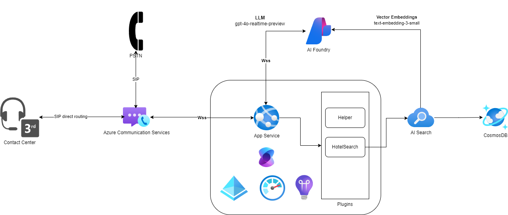

# VoiceBOT with ACS and GPT-4o-realtime-audio

This application demonstrates the integration of Azure Communication Services with GPT-4o-realtime audio API using Semantic Kernel.

This implementation is inspired by original ACS openAI implementation found [here](https://github.com/Azure-Samples/communication-services-python-quickstarts/tree/main/callautomation-openai-sample).

## Highover Architecture




## Prerequisites

- An Azure account with an active subscription. [Create an account for free](https://azure.microsoft.com/free/?WT.mc_id=A261C142F).
- A deployed Communication Services resource. [Create a Communication Services resource](https://docs.microsoft.com/azure/communication-services/quickstarts/create-communication-resource).
- A [phone number](https://learn.microsoft.com/en-us/azure/communication-services/quickstarts/telephony/get-phone-number) in your Azure Communication Services resource that can get inbound calls. NB: phone numbers are not available in free subscriptions.
- [Python](https://www.python.org/downloads/) 3.9 or above.
- An Azure OpenAI Resource and Deployed Model. See [instructions](https://learn.microsoft.com/en-us/azure/ai-services/openai/how-to/create-resource?pivots=web-portal).
- An Azure AI Search Deployment with Vector embedding Model. See [instructions](ai_search\README.md).
- Install `uv`, see [the uv docs](https://docs.astral.sh/uv/getting-started/installation/).

## To run the app

1. Open an instance of PowerShell, Windows Terminal, Command Prompt or equivalent and navigate to the directory that you would like to clone the sample to.
2. git clone `https://github.com/microsoft/semantic-kernel.git`.
3. Navigate to `python/samples/demos/call_automation` folder

### Setup and host your Azure DevTunnel

[Azure DevTunnels](https://learn.microsoft.com/en-us/azure/developer/dev-tunnels/overview) is an Azure service that enables you to share local web services hosted on the internet. Use the commands below to connect your local development environment to the public internet. This creates a tunnel with a persistent endpoint URL and which allows anonymous access. We will then use this endpoint to notify your application of calling events from the ACS Call Automation service.

```bash
devtunnel login -d
devtunnel create --allow-anonymous
devtunnel port create -p 8080
devtunnel host
```

### Configuring application

#### Setting up ACS, Azure AI Foundry and AI Search

Copy the `.env.example` file to `.env` and update the following values:

1. `ACS_CONNECTION_STRING`: Azure Communication Service resource's connection string.
2. `CALLBACK_URI_HOST`: Base url of the app. (For local development use the dev tunnel url from the step above)
3. `AZURE_OPENAI_ENDPOINT`: Azure Open AI service endpoint
4. `AZURE_OPENAI_REALTIME_DEPLOYMENT_NAME`: Azure Open AI deployment name
5. `AZURE_OPENAI_API_VERSION`: Azure Open AI API version, this should be one that includes the realtime api, for instance '2024-10-01-preview'
6. `AZURE_OPENAI_API_KEY`: Azure Open AI API key, optionally, you can also use Entra Auth.
7. `AZURE_AI_SEARCH_ENDPOINT`: Azure AI Search endpoint.
8. `AZURE_AI_SEARCH_SERVICE`: Azure AI Search service name.
9. `AZURE_AI_SEARCH_API_KEY`: Azure AI Search API key.
10. `AZURE_AI_SEARCH_INDEX_NAME`: Index name for the collection in Azure AI Search.


#### Setting up Azure OpenAI embedding model

Copy the `.env.embedding.example` file to `embedding.env` and update the following values:

1. `AZURE_OPENAI_EMBEDDING_DEPLOYMENT_NAME`: Azure OpenAI Embedding deployment name.
2. `AZURE_OPENAI_ENDPOINT`: Base url of the app. (For local development use the dev tunnel url from the step above)
3. `AZURE_OPENAI_API_KEY`: Azure Open AI service endpoint
4. `AZURE_OPENAI_API_VERSION`: Azure Open AI deployment name


## Run the app

1. Do one of the following to start the main application:
   - run `main.py` in debug mode from your IDE (VSCode will load your .env variables into the environment automatically, other IDE's might need an extra step).
   - execute `uv run --env-file .env main.py` directly in your terminal (this uses `uv`, which will then install the requirements in a temporary virtual environment, see [uv docs](https://docs.astral.sh/uv/guides/scripts) for more info).
2. Browser should pop up with a simple page. If not navigate it to `http://localhost:8080/` or your dev tunnel url.
3. Register an EventGrid Webhook for the IncomingCall(`https://<devtunnelurl>/api/incomingCall`) event that points to your devtunnel URI. Instructions [here](https://learn.microsoft.com/en-us/azure/communication-services/concepts/call-automation/incoming-call-notification).

Once that's completed you should have a running application. The way to test this is to place a call to your ACS phone number and talk to your intelligent agent!
